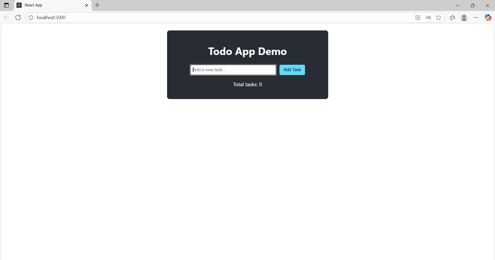
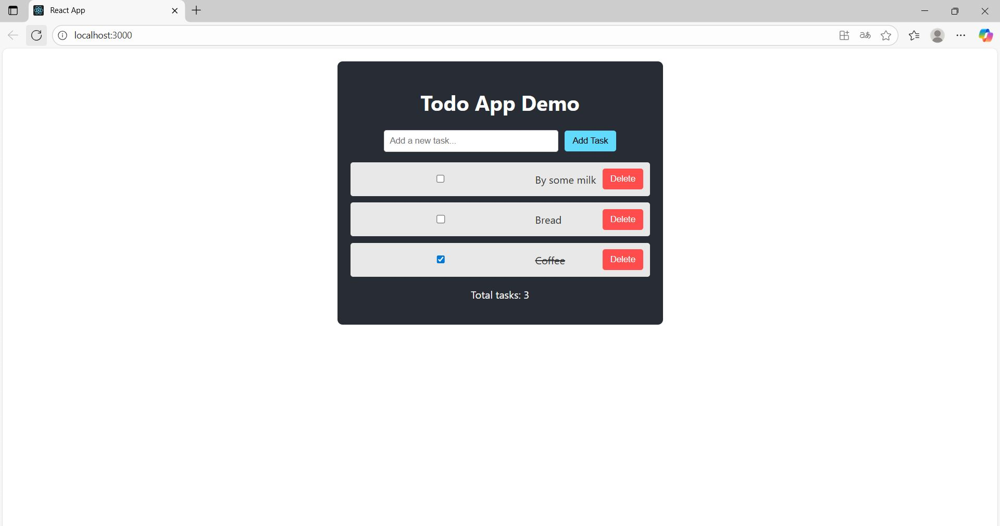

# React Todo App Demo

## Description
Simple React Todo App created for my Upwork portfolio. This project showcases entry-level full-stack skills with CRUD functionality: add tasks, toggle completion, and delete tasks. Built using React hooks for state management, optimized for readability with custom CSS.

## Features
- Add tasks (via input field and Enter key or Add Task button)
- Toggle task completion (checkbox strikes through text)
- Delete tasks (with a red Delete button)

## Tech Stack
- React (useState hook)
- JavaScript
- CSS (responsive, dark theme)

## Screenshots
 <!-- Initial state of the app -->
 <!-- App with tasks, completion, and delete action -->

## How to Run
1. Clone the repository: `git clone https://github.com/EugenyZhernoklev/react-todo-app.git`
2. Navigate to the project folder: `cd react-todo-app`
3. Install dependencies: `npm install`
4. Start the app: `npm start`

## Live Demo
Live demo: https://eugenyzhernoklev.github.io/react-todo-app

## Author
Eugeny Zhernoklev | [Upwork Profile](https://www.upwork.com/freelancers/~yourprofileid) <!-- Replace with your Upwork URL when ready -->

## Notes
This demo highlights my beginner full-stack capabilities. Open to feedback and collaboration!
